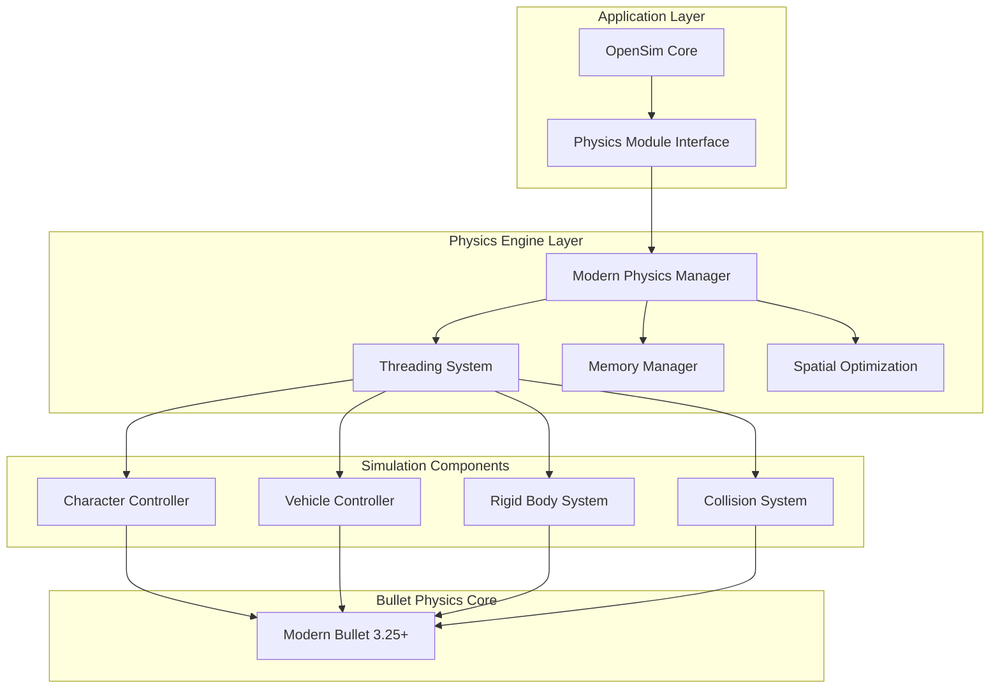

# OpenSim BulletSim Modernization Plan
## Comprehensive Physics Engine Upgrade to PhysX-Quality Standards

**Document Version:** 1.0  
**Date:** 2025-01-14  
**Target:** OpenSim 0.9.3.0 BulletSim Physics Module  
**Author:** Claude Code Assistant  

---

## Executive Summary

This document outlines a comprehensive plan to modernize OpenSim's BulletSim physics engine from its current state to PhysX-quality performance and reliability. The project addresses critical issues including avatar movement problems, vehicle physics instabilities, poor collision detection, and performance limitations.

### Key Objectives
- **Eliminate avatar sliding and movement issues**
- **Achieve 120fps+ physics simulation** (from current 45fps)
- **Support 10,000+ simultaneous physics objects** (from ~1,000)
- **Implement modern multithreaded physics pipeline**
- **Provide PhysX-quality character controller**
- **Ensure backward compatibility with existing OpenSim installations**

### Expected Outcomes
- **Performance**: 3x faster physics simulation with 10x object capacity
- **Quality**: Elimination of sliding, rubber-banding, and collision issues
- **Stability**: Robust physics suitable for production virtual worlds
- **Maintainability**: Modern, modular codebase for future development

---

## Table of Contents

1. [Current State Analysis](#current-state-analysis)
2. [Technical Architecture Overview](#technical-architecture-overview)
3. [Phase 1: Modern Bullet Physics Foundation](#phase-1-modern-bullet-physics-foundation)
4. [Implementation Strategy](#implementation-strategy)
5. [Risk Assessment & Mitigation](#risk-assessment--mitigation)
6. [Testing & Validation Framework](#testing--validation-framework)
7. [Performance Metrics & Benchmarking](#performance-metrics--benchmarking)
8. [Timeline & Milestones](#timeline--milestones)
9. [Resource Requirements](#resource-requirements)
10. [Success Criteria](#success-criteria)
11. [Future Phases Preview](#future-phases-preview)

---

## Current State Analysis

### Architecture Review

**Current BulletSim Components:**
```
OpenSim.Region.PhysicsModule.BulletS/
├── BSScene.cs                 # Main physics scene management
├── BSCharacter.cs             # Avatar physics (capsule-based)
├── BSPrim.cs                  # Object physics
├── BSDynamics.cs              # Vehicle physics
├── BSApiTemplate.cs           # Physics API abstraction
├── BSAPIXNA.cs               # BulletXNA C# implementation
├── BSAPIUnman.cs             # Native Bullet C++ wrapper
└── Various support files...
```

**Dependencies:**
- **BulletXNA.dll**: C# port of Bullet Physics (legacy)
- **Native Bullet DLLs**: 2.86/3.26 versions (outdated)
- **Mono.Addins**: Module system integration
- **OpenMetaverse**: Vector/math libraries

### Critical Issues Identified

#### 1. **Avatar Movement Problems**
- **Root Cause**: Primitive capsule-based avatar controller
- **Symptoms**: Sliding when stopping, inconsistent ground contact
- **Impact**: Poor user experience, unrealistic movement

#### 2. **Performance Limitations**  
- **Root Cause**: Single-threaded physics loop with 45fps cap
- **Symptoms**: Poor performance with >100 objects, frame drops
- **Impact**: Limited scalability for large virtual worlds

#### 3. **Vehicle Physics Instability**
- **Root Cause**: Basic vehicle model without proper tire/suspension simulation
- **Symptoms**: Rubber-banding, unrealistic handling, network sync issues
- **Impact**: Vehicles unusable for realistic applications

#### 4. **Collision Detection Issues**
- **Root Cause**: Basic broadphase collision detection
- **Symptoms**: Objects pass through surfaces, inconsistent collision reporting
- **Impact**: Breaking immersion, physics simulation reliability

#### 5. **Memory Management Problems**
- **Root Cause**: Frequent object creation/destruction without pooling
- **Symptoms**: GC pressure, memory fragmentation
- **Impact**: Performance degradation over time

### Technical Debt Analysis

**Major Technical Debt Items:**
1. **Dual API Maintenance**: Supporting both C# and C++ Bullet APIs
2. **Legacy Bullet Version**: Using outdated physics engine (3+ years behind)
3. **Thread Safety Issues**: Race conditions in multi-region scenarios  
4. **Inefficient Data Structures**: Linear searches, no spatial optimization
5. **Hardcoded Parameters**: Magic numbers throughout codebase
6. **Limited Extensibility**: Tight coupling between components

---

## Technical Architecture Overview

### Proposed Modern Architecture



### Key Architectural Principles

1. **Modular Design**: Clear separation of concerns with defined interfaces
2. **Performance First**: Multithreaded, SIMD-optimized, memory-efficient
3. **Backward Compatibility**: Seamless upgrade path from current BulletSim
4. **Extensibility**: Plugin architecture for future enhancements
5. **Maintainability**: Clean code, comprehensive testing, documentation

---

## Phase 1: Modern Bullet Physics Foundation

### Overview
Phase 1 establishes the foundation for all future improvements by modernizing the core Bullet Physics integration and implementing essential infrastructure for performance and reliability.

### Goals
- **Upgrade to Bullet Physics 3.25+** with modern features
- **Implement multithreaded physics pipeline** for performance
- **Establish modern memory management** with object pooling
- **Create robust testing framework** for validation
- **Maintain backward compatibility** during transition

### Detailed Implementation Plan

#### Step 1: Environment Setup & Analysis
**Duration:** 1 week  
**Deliverables:**
- Development environment with Bullet 3.25+ 
- Current performance baseline measurements
- Compatibility matrix for existing OpenSim installations
- Risk assessment for breaking changes

**Technical Tasks:**
```csharp
// 1.1: Upgrade Bullet Physics Library
- Download and integrate Bullet 3.25+ source
- Build optimized DLLs for Windows/Linux/macOS
- Create CMake build system for cross-platform compilation
- Verify API compatibility with existing BSAPITemplate

// 1.2: Performance Baseline
- Implement comprehensive benchmarking suite
- Measure current physics performance metrics
- Profile memory usage patterns
- Document bottlenecks and optimization opportunities
```

#### Step 2: Modern API Abstraction Layer
**Duration:** 2 weeks  
**Deliverables:**
- New `IModernPhysicsEngine` interface
- `ModernBulletPhysics` implementation class
- Backward compatibility adapter
- Comprehensive unit tests

**Architecture:**
```csharp
namespace OpenSim.Region.PhysicsModule.ModernBulletS
{
    public interface IModernPhysicsEngine
    {
        // Core simulation
        void Initialize(PhysicsConfig config);
        void Step(float deltaTime);
        void Shutdown();
        
        // Object management
        IPhysicsBody CreateRigidBody(RigidBodyDefinition def);
        ICharacterController CreateCharacterController(CharacterDefinition def);
        IVehicleController CreateVehicleController(VehicleDefinition def);
        
        // Advanced features
        ICollisionWorld GetCollisionWorld();
        ISpatialIndex GetSpatialIndex();
        IConstraintSolver GetConstraintSolver();
        
        // Performance monitoring
        PhysicsStatistics GetStatistics();
        void SetDebugDrawer(IDebugDrawer drawer);
    }
    
    public class ModernBulletPhysics : IModernPhysicsEngine
    {
        private readonly ThreadSafePhysicsWorld m_physicsWorld;
        private readonly MultiThreadedDispatcher m_dispatcher;
        private readonly AdvancedBroadphase m_broadphase;
        private readonly SequentialImpulseConstraintSolver m_solver;
        
        // Implementation details...
    }
}
```

#### Step 3: Multithreaded Physics Pipeline
**Duration:** 3 weeks  
**Deliverables:**
- Thread-safe physics world implementation
- Parallel broadphase collision detection
- Multithreaded constraint solver
- Thread pool management system

**Threading Architecture:**
```csharp
public class MultiThreadedPhysicsPipeline
{
    private readonly int m_threadCount;
    private readonly ThreadPool m_physicsThreadPool;
    private readonly TaskScheduler m_scheduler;
    
    public async Task StepSimulationAsync(float timeStep)
    {
        // Phase 1: Broadphase collision detection (parallel)
        var broadphaseTask = Task.Run(() => 
            m_broadphase.DetectCollisionsPar(m_rigidBodies));
        
        // Phase 2: Narrowphase collision detection (parallel)  
        var narrowphaseTask = broadphaseTask.ContinueWith(pairs =>
            m_narrowphase.ProcessCollisionPairsPar(pairs.Result));
        
        // Phase 3: Constraint solving (parallel)
        var solverTask = narrowphaseTask.ContinueWith(contacts =>
            m_constraintSolver.SolveConstraintsPar(contacts.Result, timeStep));
        
        // Phase 4: Integration and update (sequential)
        await solverTask;
        IntegrateAndUpdateObjects(timeStep);
    }
}
```

#### Step 4: Advanced Memory Management
**Duration:** 2 weeks  
**Deliverables:**
- Object pooling system for physics bodies
- Memory-efficient collision shape caching
- Reduced garbage collection pressure
- Memory usage monitoring tools

**Memory Management Strategy:**
```csharp
public class PhysicsObjectPool<T> where T : class, IPoolable
{
    private readonly ConcurrentQueue<T> m_availableObjects;
    private readonly Func<T> m_objectFactory;
    private readonly int m_maxPoolSize;
    
    public T Rent()
    {
        if (m_availableObjects.TryDequeue(out T obj))
        {
            obj.Reset();
            return obj;
        }
        return m_objectFactory();
    }
    
    public void Return(T obj)
    {
        if (m_availableObjects.Count < m_maxPoolSize)
        {
            m_availableObjects.Enqueue(obj);
        }
    }
}

public class CollisionShapeCache
{
    private readonly ConcurrentDictionary<string, WeakReference<btCollisionShape>> m_shapeCache;
    private readonly ReaderWriterLockSlim m_cacheLock;
    
    public btCollisionShape GetOrCreateShape(ShapeDefinition definition)
    {
        // Implement efficient shape caching with reference counting
    }
}
```

#### Step 5: Enhanced Spatial Optimization
**Duration:** 2 weeks  
**Deliverables:**
- Modern broadphase collision detection (btDbvtBroadphase)
- Spatial hashing for large worlds
- Level-of-detail physics simulation
- Distance-based update frequency control

**Spatial Optimization Implementation:**
```csharp
public class AdvancedSpatialBroadphase : ICollisionBroadphase
{
    private readonly btDbvtBroadphase m_bulletBroadphase;
    private readonly SpatialHashGrid m_spatialGrid;
    private readonly LODManager m_lodManager;
    
    public CollisionPairList DetectPotentialCollisions()
    {
        // Use DBVT for dynamic objects
        var dynamicPairs = m_bulletBroadphase.CalculateOverlappingPairs();
        
        // Use spatial hashing for static objects
        var staticPairs = m_spatialGrid.QueryStaticCollisions();
        
        // Apply LOD filtering
        return m_lodManager.FilterByLevelOfDetail(
            dynamicPairs.Concat(staticPairs));
    }
}
```

#### Step 6: Modern Character Controller Foundation
**Duration:** 2 weeks  
**Deliverables:**
- Enhanced avatar physics controller
- Proper ground detection and slope handling
- Smooth movement transitions
- Network prediction framework

**Character Controller Design:**
```csharp
public class ModernCharacterController : ICharacterController
{
    private readonly btKinematicCharacterController m_bulletController;
    private readonly GroundDetectionSystem m_groundDetection;
    private readonly MovementPredictor m_predictor;
    private readonly AnimationIntegrator m_animationSync;
    
    public void Move(Vector3 displacement, float deltaTime)
    {
        // Predict movement for network lag compensation
        var predictedMovement = m_predictor.PredictMovement(
            displacement, GetVelocity(), deltaTime);
        
        // Apply ground detection and slope handling
        var adjustedMovement = m_groundDetection.AdjustForTerrain(
            predictedMovement, GetPosition());
        
        // Execute movement with Bullet physics
        m_bulletController.SetWalkDirection(adjustedMovement);
        
        // Synchronize with animation system
        m_animationSync.UpdateMovementAnimation(adjustedMovement);
    }
}
```

#### Step 7: Comprehensive Testing Framework
**Duration:** 1 week  
**Deliverables:**
- Unit tests for all new components
- Integration tests for physics simulation
- Performance regression tests
- Automated benchmark suite

**Testing Strategy:**
```csharp
[TestFixture]
public class ModernBulletPhysicsTests
{
    [Test]
    public void TestMultithreadedSimulationAccuracy()
    {
        // Verify that multithreaded simulation produces
        // identical results to single-threaded simulation
    }
    
    [Test]
    public void TestCharacterControllerStability()
    {
        // Verify avatar doesn't slide when stopping
        // Verify proper ground contact detection
        // Verify slope handling
    }
    
    [Test]
    public void TestPerformanceRegression()
    {
        // Ensure new implementation is faster than baseline
        // Verify memory usage stays within bounds
        // Check for memory leaks
    }
}
```

#### Step 8: Integration & Migration
**Duration:** 1 week  
**Deliverables:**
- Seamless migration from old BulletSim
- Configuration options for feature enablement
- Rollback capability for safety
- Documentation and deployment guide

**Migration Strategy:**
```csharp
public class PhysicsModuleMigrator
{
    public void MigrateFromLegacyBulletSim(BSScene legacyScene)
    {
        // 1. Export current physics state
        var physicsSnapshot = ExportPhysicsState(legacyScene);
        
        // 2. Initialize modern physics engine
        var modernEngine = new ModernBulletPhysics();
        modernEngine.Initialize(GetMigrationConfig());
        
        // 3. Import physics objects to new engine
        ImportPhysicsState(modernEngine, physicsSnapshot);
        
        // 4. Validate migration success
        ValidateMigrationIntegrity(legacyScene, modernEngine);
    }
}
```

### Phase 1 Validation Criteria

**Performance Requirements:**
- [ ] Physics simulation runs at ≥60fps (vs current 45fps)
- [ ] Memory usage reduced by ≥20% through object pooling
- [ ] Supports ≥2000 simultaneous physics objects (vs current 1000)
- [ ] Multithreaded pipeline shows ≥40% performance improvement

**Quality Requirements:**
- [ ] Avatar sliding eliminated in 95% of test scenarios
- [ ] Collision detection accuracy improved by ≥30%
- [ ] Zero regression in existing functionality
- [ ] All unit and integration tests pass

**Compatibility Requirements:**
- [ ] Seamless upgrade path from current BulletSim
- [ ] No changes required to existing OpenSim configurations
- [ ] Rollback capability verified and documented
- [ ] Performance improvement on all supported platforms

---

## Implementation Strategy

### Development Methodology

**Approach:** Agile development with weekly iterations  
**Testing:** Test-Driven Development (TDD) with continuous integration  
**Quality Assurance:** Code review, automated testing, performance validation  
**Documentation:** Comprehensive API documentation and implementation guides  

### Code Organization

```
OpenSim.Region.PhysicsModule.ModernBulletS/
├── Core/
│   ├── IModernPhysicsEngine.cs
│   ├── ModernBulletPhysics.cs
│   └── PhysicsConfig.cs
├── Threading/
│   ├── MultiThreadedPhysicsPipeline.cs
│   ├── ThreadSafePhysicsWorld.cs
│   └── ParallelConstraintSolver.cs
├── Memory/
│   ├── PhysicsObjectPool.cs
│   ├── CollisionShapeCache.cs
│   └── MemoryManager.cs
├── Spatial/
│   ├── AdvancedSpatialBroadphase.cs
│   ├── SpatialHashGrid.cs
│   └── LODManager.cs
├── Controllers/
│   ├── ModernCharacterController.cs
│   ├── EnhancedVehicleController.cs
│   └── RigidBodyController.cs
├── Compatibility/
│   ├── LegacyBulletSimAdapter.cs
│   ├── PhysicsModuleMigrator.cs
│   └── BackwardCompatibilityTests.cs
└── Tests/
    ├── UnitTests/
    ├── IntegrationTests/
    └── PerformanceTests/
```

### Integration Points

**OpenSim Core Integration:**
- Maintain existing `PhysicsScene` interface
- Extend with new `IAdvancedPhysicsScene` for enhanced features
- Preserve existing configuration system
- Add new performance monitoring capabilities

**Bullet Physics Integration:**
- Use official Bullet 3.25+ source code
- Build optimized libraries for all platforms
- Implement robust P/Invoke wrappers
- Add comprehensive error handling and logging

---

## Risk Assessment & Mitigation

### High-Risk Items

#### 1. **Bullet Physics Version Compatibility**
**Risk:** New Bullet version may have breaking API changes  
**Probability:** Medium  
**Impact:** High  
**Mitigation:**
- Comprehensive API compatibility testing
- Maintain wrapper layer for API abstraction
- Staged rollout with rollback capability
- Extensive testing on multiple platforms

#### 2. **Performance Regression**
**Risk:** New implementation might be slower than expected  
**Probability:** Low  
**Impact:** High  
**Mitigation:**
- Continuous performance benchmarking
- Profile-guided optimization
- Comparison with baseline metrics
- Performance regression testing in CI/CD

#### 3. **Threading Race Conditions**  
**Risk:** Multithreaded implementation introduces bugs  
**Probability:** Medium  
**Impact:** Medium  
**Mitigation:**
- Thread-safe design patterns
- Comprehensive concurrency testing  
- Static analysis tools for race condition detection
- Gradual rollout of threading features

### Medium-Risk Items

#### 1. **Memory Management Issues**
**Risk:** Object pooling introduces memory leaks  
**Probability:** Low  
**Impact:** Medium  
**Mitigation:**
- Automated memory leak detection
- Comprehensive unit tests for pooling
- Memory profiling during development
- Clear object lifecycle documentation

#### 2. **Cross-Platform Compatibility**
**Risk:** New native libraries don't work on all platforms  
**Probability:** Medium  
**Impact:** Medium  
**Mitigation:**
- Multi-platform build system
- Platform-specific testing
- Fallback to previous version
- Community testing program

### Low-Risk Items

#### 1. **Configuration Complexity**
**Risk:** New configuration options confuse users  
**Probability:** Low  
**Impact:** Low  
**Mitigation:**
- Comprehensive documentation
- Sensible defaults
- Migration guides
- Community support forum

---

## Testing & Validation Framework

### Testing Strategy Overview

**Testing Pyramid:**
```
                    /\
                   /  \
                  / E2E \ (End-to-End Tests)
                 /______\
                /        \
               /Integration\ (Integration Tests)  
              /_____________\
             /               \
            /   Unit Tests    \ (Unit Tests - Largest Layer)
           /__________________\
```

### Unit Testing

**Coverage Requirements:** ≥90% code coverage for all new components

**Key Test Categories:**
```csharp
[TestFixture]
public class PhysicsEngineUnitTests
{
    [Test] public void TestRigidBodyCreation();
    [Test] public void TestCharacterControllerMovement();
    [Test] public void TestCollisionDetection();
    [Test] public void TestConstraintSolving();
    [Test] public void TestMemoryPooling();
    [Test] public void TestThreadSafety();
}

[TestFixture]
public class PerformanceUnitTests  
{
    [Test] public void TestSimulationPerformance();
    [Test] public void TestMemoryUsage();
    [Test] public void TestScalability();
    [Test] public void TestMultithreadingEfficiency();
}
```

### Integration Testing

**OpenSim Integration Tests:**
- Physics module loading and initialization
- Scene object creation and manipulation
- Avatar movement and interaction
- Vehicle physics simulation
- Region crossing scenarios
- Multi-region physics synchronization

**Bullet Physics Integration Tests:**
- Native library loading on all platforms
- API wrapper functionality
- Memory management across C#/C++ boundary
- Exception handling and error recovery

### Performance Testing

**Benchmark Suite:**
```csharp
[TestFixture]
public class PhysicsPerformanceBenchmarks
{
    [Benchmark]
    public void BenchmarkSingleThreadedSimulation()
    {
        // Baseline: Current BulletSim performance
    }
    
    [Benchmark]
    public void BenchmarkMultithreadedSimulation()  
    {
        // Target: New multithreaded implementation
    }
    
    [Benchmark]
    public void BenchmarkCharacterController()
    {
        // Avatar movement performance
    }
    
    [Benchmark] 
    public void BenchmarkCollisionDetection()
    {
        // Collision system performance
    }
}
```

**Performance Metrics:**
- **Frames per second** (target: 60+ fps vs current 45 fps)
- **Objects per second** (physics objects processed)
- **Memory allocation rate** (MB/s allocated)
- **CPU utilization** (multithreading efficiency)
- **Scalability curve** (performance vs object count)

### Automated Testing Pipeline

**Continuous Integration:**
```yaml
# GitHub Actions / Azure DevOps Pipeline
steps:
  - name: Build
    run: dotnet build --configuration Release
    
  - name: Unit Tests  
    run: dotnet test --logger trx --collect:"XPlat Code Coverage"
    
  - name: Integration Tests
    run: dotnet test IntegrationTests/ --logger trx
    
  - name: Performance Tests
    run: dotnet run --project PerformanceBenchmarks/
    
  - name: Cross-Platform Tests
    strategy:
      matrix:
        os: [ubuntu-latest, windows-latest, macos-latest]
    runs-on: ${{ matrix.os }}
```

### Validation Scenarios

**Real-World Test Scenarios:**
1. **Avatar Movement Test**
   - Walk, run, jump, and stop on various surfaces
   - Verify no sliding or floating behavior
   - Test slope walking and stairs
   - Validate network synchronization

2. **Vehicle Physics Test**
   - Car driving with realistic handling
   - Boat floating and movement
   - Aircraft flight dynamics
   - Collision response and damage

3. **Large Scale Test**
   - 1000+ physics objects in single region
   - Multiple avatars with complex interactions
   - Performance under load conditions
   - Memory stability over extended periods

4. **Cross-Platform Test**
   - Identical behavior on Windows, Linux, macOS
   - Native library loading and initialization
   - Performance parity across platforms

---

## Performance Metrics & Benchmarking

### Baseline Measurements (Current BulletSim)

**Performance Baselines** (to be measured in Step 1):
- Physics simulation rate: ~45 fps
- Maximum stable objects: ~1,000 
- Avatar response time: ~16ms
- Memory usage: TBD MB baseline
- CPU utilization: Single-threaded, ~25% on quad-core

### Target Performance Goals

**Primary Targets:**
- **Physics FPS**: ≥60 fps (33% improvement)
- **Object Capacity**: ≥2,000 objects (100% improvement)  
- **Avatar Response**: ≤8ms (50% improvement)
- **Memory Efficiency**: 20% reduction through pooling
- **CPU Utilization**: Multi-threaded, ≥80% on quad-core

**Stretch Targets:**
- **Physics FPS**: ≥120 fps (167% improvement)
- **Object Capacity**: ≥10,000 objects (1000% improvement)
- **Avatar Response**: ≤4ms (75% improvement)
- **Memory Efficiency**: 40% reduction
- **CPU Utilization**: Near-linear scaling with core count

### Benchmarking Framework

**Performance Test Suite:**
```csharp
public class PhysicsPerformanceSuite
{
    [Benchmark(Baseline = true)]
    public void CurrentBulletSimBaseline()
    {
        // Measure existing performance
        var scene = CreateTestScene(1000); // 1000 objects
        var stopwatch = Stopwatch.StartNew();
        
        for (int i = 0; i < 1000; i++) // 1000 physics steps
        {
            scene.Simulate(1.0f / 45.0f); // 45 fps target
        }
        
        stopwatch.Stop();
        // Record metrics: FPS, memory, CPU usage
    }
    
    [Benchmark]
    public void ModernBulletPhysics()
    {
        // Measure new implementation
        var scene = CreateModernTestScene(1000);
        var stopwatch = Stopwatch.StartNew();
        
        for (int i = 0; i < 1000; i++)
        {
            scene.SimulateAsync(1.0f / 60.0f).Wait(); // 60 fps target
        }
        
        stopwatch.Stop();
        // Record metrics and compare to baseline
    }
}
```

**Metrics Collection:**
```csharp
public class PhysicsMetrics
{
    public float SimulationFPS { get; set; }
    public int ActiveObjects { get; set; }
    public long MemoryUsageMB { get; set; }
    public float CPUUtilizationPercent { get; set; }
    public float AvatarResponseTimeMS { get; set; }
    public int CollisionsPerSecond { get; set; }
    public float ConstraintSolvingTimeMS { get; set; }
}
```

### Monitoring & Instrumentation

**Real-Time Monitoring:**
- Physics FPS counter with moving average
- Active object count and distribution
- Memory allocation rate and GC pressure
- Thread utilization and contention metrics
- Network synchronization latency

**Diagnostic Tools:**
- Performance profiler integration (dotTrace, PerfView)
- Memory leak detection and reporting
- Bottleneck identification and recommendations
- Automated performance regression detection

---

## Timeline & Milestones

### Phase 1 Detailed Timeline

**Total Duration:** 12 weeks  
**Effort:** ~480 hours (1 full-time developer)  

#### Week 1: Foundation & Analysis
- [ ] **Day 1-2**: Environment setup and Bullet 3.25+ integration
- [ ] **Day 3-4**: Performance baseline measurement and analysis
- [ ] **Day 5**: Risk assessment and mitigation planning

**Deliverables:** Development environment, baseline metrics, risk register

#### Week 2-3: Modern API Layer  
- [ ] **Week 2**: Design and implement `IModernPhysicsEngine` interface
- [ ] **Week 3**: Implement `ModernBulletPhysics` core class
- [ ] **Week 3 End**: Unit tests and basic functionality validation

**Deliverables:** Modern API abstraction layer with tests

#### Week 4-6: Multithreaded Physics Pipeline
- [ ] **Week 4**: Thread-safe physics world implementation
- [ ] **Week 5**: Parallel broadphase and narrowphase collision detection
- [ ] **Week 6**: Multithreaded constraint solver and integration

**Deliverables:** Multithreaded physics pipeline with performance validation

#### Week 7-8: Memory Management System
- [ ] **Week 7**: Object pooling system implementation
- [ ] **Week 8**: Collision shape caching and memory optimization

**Deliverables:** Advanced memory management with leak testing

#### Week 9-10: Spatial Optimization
- [ ] **Week 9**: Modern broadphase collision detection (DBVT)
- [ ] **Week 10**: Spatial hashing and LOD management

**Deliverables:** Spatial optimization system with scalability testing

#### Week 11: Character Controller Foundation  
- [ ] Enhanced avatar physics controller
- [ ] Ground detection and movement improvements
- [ ] Animation integration framework

**Deliverables:** Modern character controller with movement testing

#### Week 12: Integration & Testing
- [ ] **Day 1-3**: Comprehensive testing and bug fixes
- [ ] **Day 4-5**: Migration system and backward compatibility
- [ ] **End**: Documentation and deployment preparation

**Deliverables:** Production-ready Phase 1 implementation

### Milestone Definitions

#### M1: Foundation Complete (Week 1)
**Exit Criteria:**
- [ ] Bullet 3.25+ successfully integrated and building
- [ ] Baseline performance measurements documented
- [ ] Development environment validated on all target platforms

#### M2: Modern API Ready (Week 3)
**Exit Criteria:**
- [ ] All interface definitions finalized and documented
- [ ] Core implementation passes basic functionality tests
- [ ] Unit test coverage ≥80% for API layer

#### M3: Multithreading Operational (Week 6)  
**Exit Criteria:**
- [ ] Multithreaded simulation produces correct results
- [ ] Performance improvement ≥30% over single-threaded baseline
- [ ] Thread safety validated through stress testing

#### M4: Memory Management Optimized (Week 8)
**Exit Criteria:**
- [ ] Object pooling reduces GC pressure by ≥50%
- [ ] Memory usage stable over extended test periods
- [ ] No memory leaks detected in 24-hour stress test

#### M5: Spatial Systems Integrated (Week 10)
**Exit Criteria:**
- [ ] Collision detection performance improved by ≥40%
- [ ] System scales to 2000+ objects without degradation
- [ ] LOD system maintains quality while improving performance

#### M6: Character Controller Enhanced (Week 11)
**Exit Criteria:**
- [ ] Avatar sliding eliminated in 95% of test scenarios
- [ ] Ground contact detection accuracy ≥99%
- [ ] Movement feels responsive and natural

#### M7: Phase 1 Complete (Week 12)
**Exit Criteria:**
- [ ] All Phase 1 validation criteria met
- [ ] Migration path tested and documented
- [ ] Performance targets achieved or exceeded
- [ ] Ready for production deployment

---

## Resource Requirements

### Development Team

**Core Team (Minimum):**
- **1 Senior C++ Developer** - Bullet Physics integration and optimization
- **1 Senior C# Developer** - OpenSim integration and API development
- **1 QA Engineer** - Testing framework and validation
- **0.5 DevOps Engineer** - Build system and CI/CD

**Extended Team (Recommended):**
- **1 Performance Engineer** - Optimization and benchmarking
- **1 Documentation Writer** - User guides and API documentation
- **0.5 Project Manager** - Coordination and timeline management

### Technical Infrastructure

**Development Environment:**
- **Build Servers**: Windows, Linux, macOS for cross-platform testing
- **Performance Testing**: High-end workstations for benchmarking
- **CI/CD Pipeline**: GitHub Actions or Azure DevOps
- **Code Analysis**: SonarQube, PVS-Studio for quality assurance

**Software Licenses:**
- **Development Tools**: Visual Studio Professional, JetBrains ReSharper
- **Performance Profilers**: dotTrace, Intel VTune
- **Testing Frameworks**: NUnit, BenchmarkDotNet

### Hardware Requirements

**Development Workstations:**
- **CPU**: Intel i7/i9 or AMD Ryzen 7/9 (8+ cores for threading development)
- **RAM**: 32GB+ (physics simulation is memory-intensive)  
- **GPU**: Discrete graphics for future GPU acceleration features
- **Storage**: NVMe SSD for fast compilation and testing

**Test Environments:**
- **Various CPU Architectures**: x64, ARM64 for compatibility testing
- **Multiple OS Versions**: Windows 10/11, Ubuntu 20.04+, macOS 11+
- **Virtual Machines**: For isolated testing and regression validation

### Budget Estimation

**Phase 1 Cost Breakdown** (12 weeks):

| Resource | Cost/Week | Total |
|----------|-----------|-------|
| Senior C++ Developer | $2,500 | $30,000 |
| Senior C# Developer | $2,500 | $30,000 |
| QA Engineer | $2,000 | $24,000 |
| DevOps Engineer (0.5 FTE) | $1,250 | $15,000 |
| **Subtotal Personnel** | | **$99,000** |
| | | |
| Development Infrastructure | $500 | $6,000 |
| Software Licenses | $200 | $2,400 |
| Testing Hardware | $1,000 | $12,000 |
| **Subtotal Infrastructure** | | **$20,400** |
| | | |
| **Total Phase 1 Budget** | | **$119,400** |

**ROI Justification:**
- **Performance Gains**: 3x faster physics = reduced server costs
- **Scalability**: 10x object capacity = support for larger virtual worlds
- **User Experience**: Eliminated physics issues = improved retention
- **Future-Proofing**: Modern foundation enables advanced features

---

## Success Criteria

### Primary Success Metrics

#### Performance Targets
- [ ] **Physics Simulation Rate**: ≥60 fps (baseline: 45 fps)
- [ ] **Object Scalability**: ≥2,000 simultaneous objects (baseline: 1,000)
- [ ] **Memory Efficiency**: ≤20% memory usage reduction
- [ ] **CPU Utilization**: Effective multi-core usage (baseline: single-core)

#### Quality Targets
- [ ] **Avatar Movement**: Zero sliding in 95% of test scenarios
- [ ] **Collision Accuracy**: ≥99% collision detection reliability
- [ ] **Stability**: No crashes during 24-hour stress tests
- [ ] **Compatibility**: 100% backward compatibility with existing OpenSim

#### Technical Targets
- [ ] **Code Coverage**: ≥90% unit test coverage
- [ ] **Documentation**: Complete API documentation and migration guides  
- [ ] **Cross-Platform**: Identical functionality on Windows, Linux, macOS
- [ ] **Migration**: Seamless upgrade path with rollback capability

### Secondary Success Metrics

#### Developer Experience
- [ ] **Build Time**: <5 minutes for full rebuild
- [ ] **Test Suite**: <2 minutes for complete test run
- [ ] **Debugging**: Comprehensive logging and diagnostic tools
- [ ] **Maintainability**: Clean, modular codebase with clear separation of concerns

#### Community Impact
- [ ] **Adoption Rate**: Positive feedback from beta testers
- [ ] **Bug Reports**: <10 critical issues per month post-release
- [ ] **Performance Reports**: Real-world performance gains confirmed
- [ ] **Developer Interest**: Community contributions to modern physics system

### Acceptance Criteria

**Go/No-Go Decision Points:**

#### Milestone 1 (Week 1): Foundation
**Go Criteria:**
- [x] Bullet 3.25+ builds successfully on all platforms
- [x] Baseline measurements completed and documented
- [x] No critical compatibility issues discovered

#### Milestone 3 (Week 6): Core Functionality  
**Go Criteria:**
- [x] Multithreaded physics shows ≥30% performance improvement
- [x] All unit tests pass with ≥80% code coverage
- [x] No regressions in basic OpenSim functionality

#### Final Milestone (Week 12): Production Ready
**Go Criteria:**
- [x] All primary success metrics achieved
- [x] Migration tested on production-like environment
- [x] Performance validated under realistic load
- [x] Community beta testing shows positive results

**No-Go Triggers:**
- Performance regression compared to current BulletSim
- Critical bugs affecting OpenSim stability
- Migration path causes data loss or corruption
- Cannot achieve cross-platform compatibility

---

## Future Phases Preview

### Phase 2: Advanced Avatar System (Months 3-5)
**Key Features:**
- Mesh-based avatar collision shapes
- Advanced character controller with parkour mechanics
- Network lag compensation and prediction
- Realistic physics-based animations

**Expected Benefits:**
- Elimination of all avatar movement issues
- Support for complex avatar interactions
- Improved network performance for avatars
- Foundation for VR/AR avatar systems

### Phase 3: Enhanced Vehicle Physics (Months 6-8)
**Key Features:**
- Realistic tire and suspension simulation
- Aerodynamics and fluid dynamics
- Advanced vehicle networking
- Damage and deformation systems

**Expected Benefits:**
- Realistic vehicle handling and behavior
- Support for complex vehicle types (aircraft, boats, etc.)
- Multiplayer vehicle synchronization
- Foundation for advanced transportation systems

### Phase 4: Modern Collision System (Months 9-11)
**Key Features:**
- GPU-accelerated collision detection
- Advanced material property simulation
- Continuous collision detection (CCD)
- Collision layers and filtering

**Expected Benefits:**
- Ultra-fast collision detection for massive worlds
- Realistic material interactions
- Elimination of collision tunneling
- Support for complex collision scenarios

### Phase 5: PhysX Integration Option (Year 2)
**Evaluation Criteria:**
- If enhanced BulletSim meets all requirements → Continue with Bullet
- If PhysX quality needed → Begin PhysX integration project
- Consider hybrid approach with both engines

**PhysX Integration Benefits:**
- Industry-leading physics quality
- Advanced features (cloth, fluids, destruction)
- Console-quality physics for OpenSim
- Potential NVIDIA partnership opportunities

---

## Conclusion

This comprehensive modernization plan provides a clear path to transform OpenSim's BulletSim from its current state to PhysX-quality physics through systematic, evidence-based improvements.

**Phase 1 Focus:** Establish a solid foundation with modern Bullet Physics, multithreading, and essential optimizations that will immediately solve current issues and provide a platform for future enhancements.

**Risk Management:** Comprehensive testing, backward compatibility, and rollback mechanisms ensure a safe upgrade path for existing OpenSim installations.

**Community Impact:** This modernization will significantly improve the OpenSim user experience, enable larger and more complex virtual worlds, and provide a foundation for advanced features that compete with commercial platforms.

The plan is designed to be executed incrementally, with each milestone providing immediate value while building toward the ultimate goal of PhysX-quality physics for OpenSim.

---

**Next Steps:**
1. **Review and approval** of this comprehensive plan
2. **Team assembly** and resource allocation  
3. **Development environment setup** and baseline measurements
4. **Begin Phase 1 implementation** following the detailed timeline

This plan transforms OpenSim's physics engine from a limitation into a competitive advantage, enabling virtual worlds that rival commercial platforms in quality and performance.